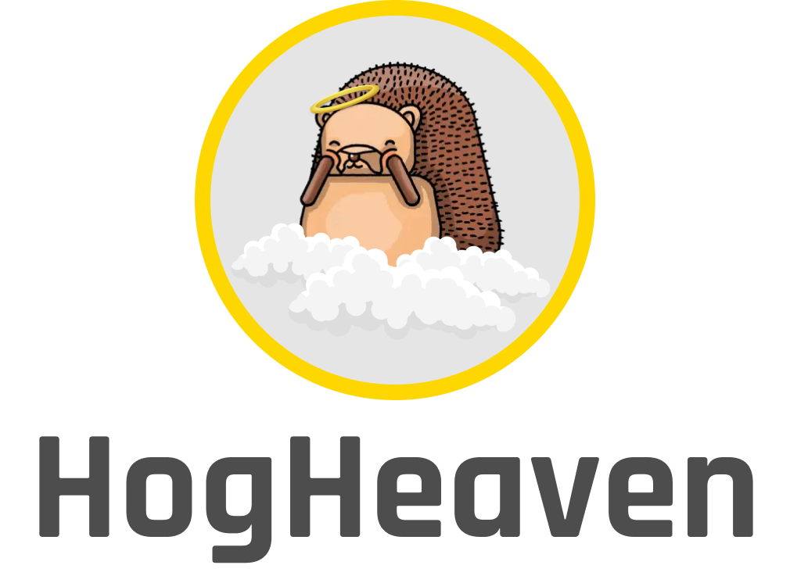

<div>
    <p align="center">
        
    </p>
    <hr>
    <blockquote align="center">
        “Bicycles are the new rollerblades, talentless is the new talented, and I’m in hog heaven.” - Ryan Seacrest
    </blockquote>
</div>

<br>

<p align="center">
  <a href="https://github.com/joggrdocs/hog-heaven/actions/workflows/github-code-scanning/codeql">
    
  </a>
  <a href="https://github.com/joggrdocs/hog-heaven/actions/workflows/ci.yaml">
    
  </a>
  <br/>
  <a href="https://github.com/standard/semistandard">
    
  </a>
  <a href="https://github.com/prettier/prettier">
    
  </a>
</p>

# Overview

GitHub action for sending release annotations to PostHog, aka make sure your PostHog cloud is in "Hog Heaven".

## Usage

```yaml
name: 'Release the Kraken'

on:
  release:
    types: [created, published]

jobs:
  publish:
    name: Publish
    runs-on: ubuntu-latest
    steps:
      - name: Checkout Code
        uses: actions/checkout@v1

      # ... do some release things...
      
      - name: Release the Kraken
        uses: joggrdocs/hog-heaven@main
        with:
          api_key: ${{ secrets.POSTHOG_API_KEY }}
          project_id: 1111111
          content: "Release - ${{ github.repository }}@${{ github.ref_name }}" 
          # => outputs: "Release - @joggrdocs/hog-heaven@v1.0.0" 
```

## License

Licensed under MIT.

<br>
<hr>
<h2 align="center">
    Want to sign up for Joggr?
</h2>
<p align="center">
    We'd love to have you join, but we are in closed beta. <br> You can join our waitlist below.
</p>
<p align="center">
    <a href="https://www.joggr.io/closed-beta-waitlist?utm_source=github&utm_medium=org-readme&utm_campaign=static-docs" alt="Join the Waitlist">
        
    </a>
</p>
